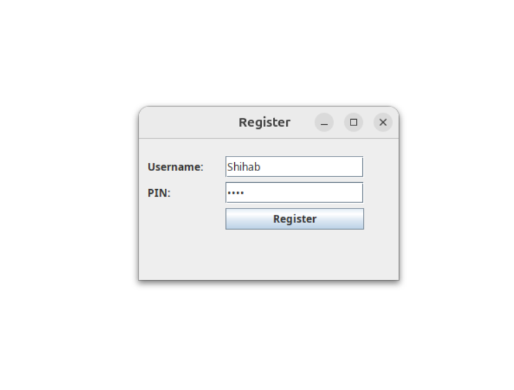
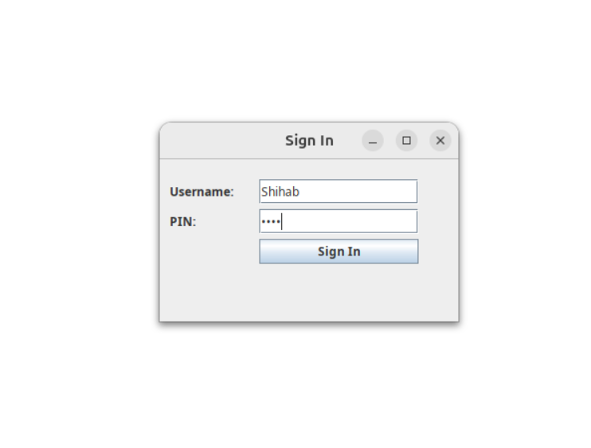
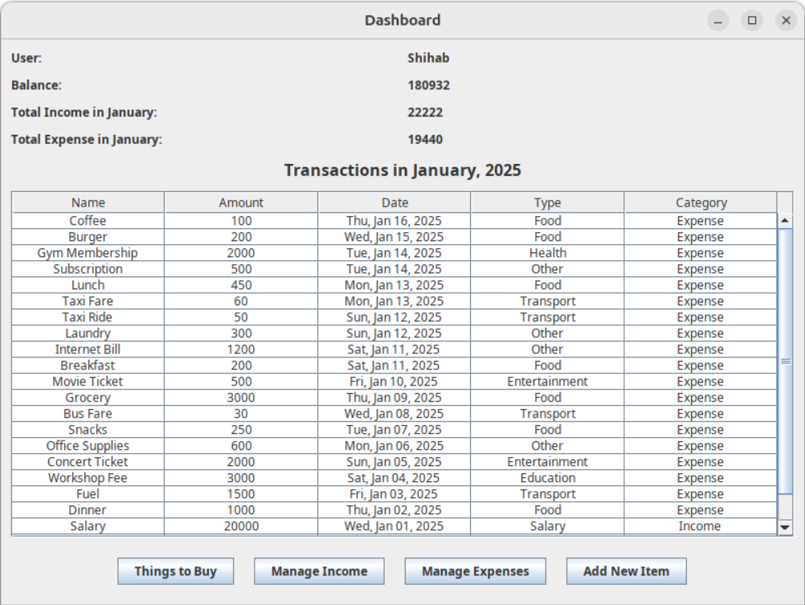
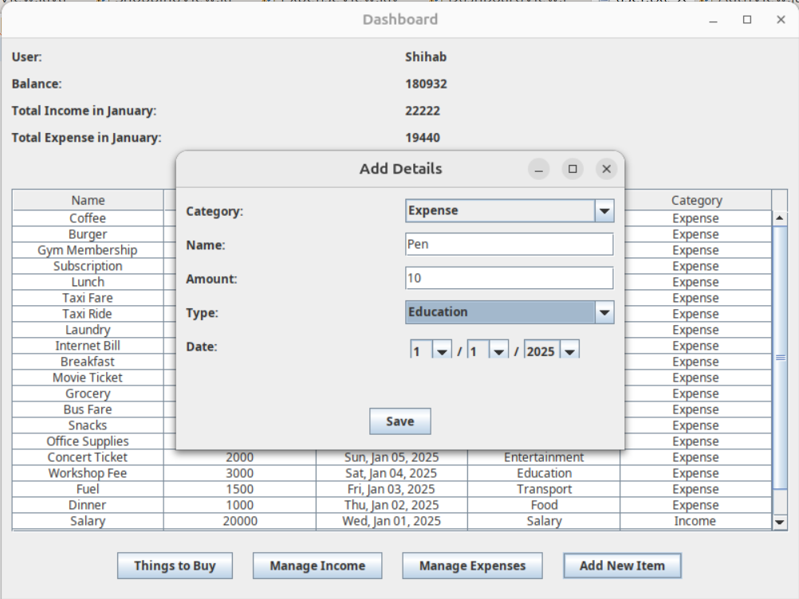
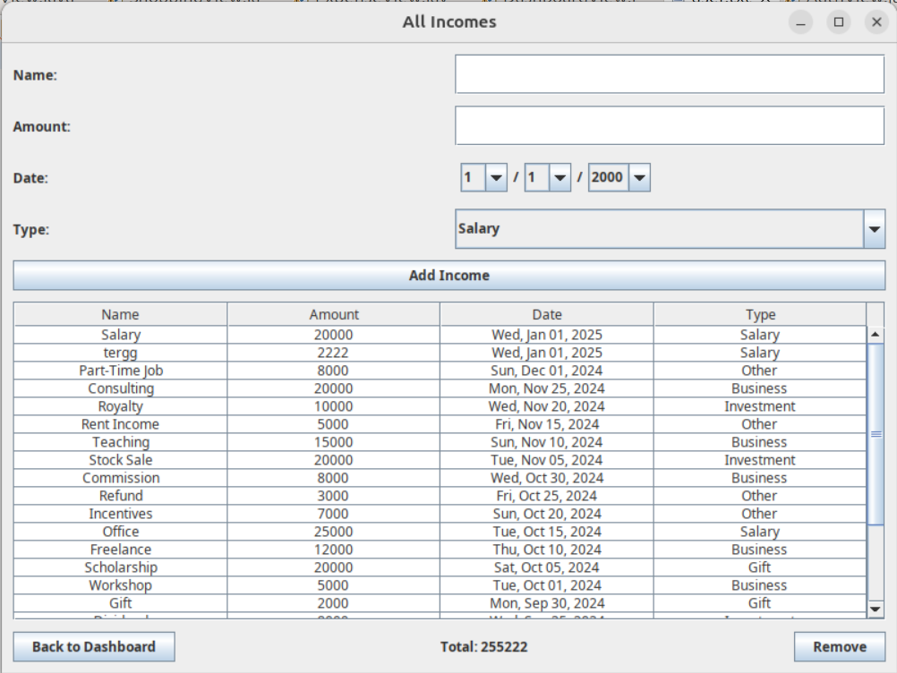
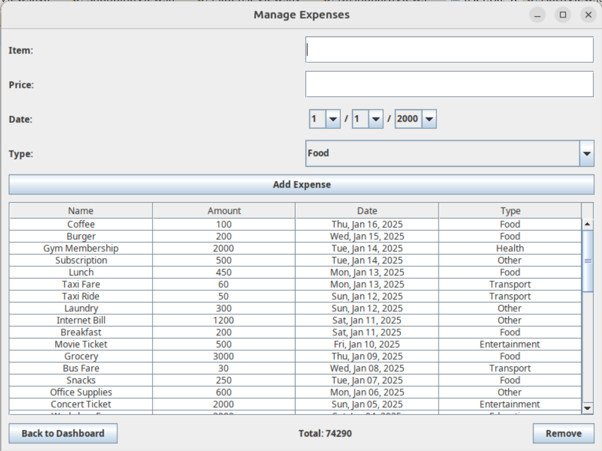
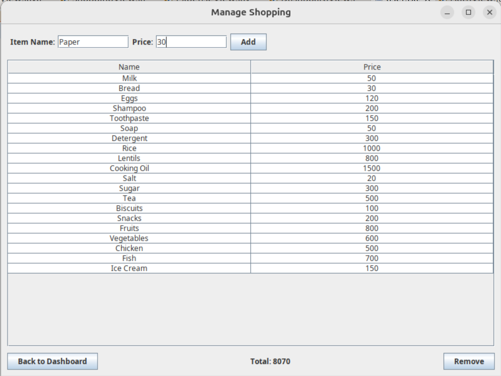

# MyWallet

**MyWallet** is a simple Java-based desktop application for managing personal finances. It helps users track their income, expenses, and shopping lists, all in one place.

---

## Features

### 1. **Register View**
- When launching the application for the first time, users are prompted to register by creating:
  - **Username**
  - **4-digit PIN**
- This ensures secure access to your financial data.



---

### 2. **Sign In View**
- If a user is already registered, they can sign in using:
  - **Username**
  - **PIN**
- Validates user credentials before granting access to the dashboard.



---

### 3. **Dashboard View**
- Provides a summary of:
  - **Balance**: Calculated as total income minus total expenses.
  - **Total Income and Expenses for the Current Month**.
  - **Transaction Log**: Displays income and expense entries for the current month, sorted by date.



---

### 4. **Add New Items**
- Add income or expense entries directly from the dashboard.
- Specify details like name, amount, type, and date.



---

### 5. **Manage Income**
- Add, view, and delete income entries.
- Categorize income by type (e.g., Salary, Business, Investment).
- Income entries are displayed in a sorted table by date.



---

### 6. **Manage Expenses**
- Add, view, and delete expense entries.
- Categorize expenses by type (e.g., Food, Transport, Health).
- Expense entries are displayed in a sorted table by date.




---

### 7. **Things to Buy**
- Manage a list of items with names and prices.
- View the total cost of all shopping items.
- Add and remove items from the list.



---

## How to Run
1. Clone the repository:
   ```bash
   git clone https://github.com/SMSehab/MyWallet.git
